## 1、任务分析

软件项目设计
主要内容：基于程序设计方法，结合样例或自选题目，完成开发案例的设计、功能点扩展和功能实现

实践重点：面向对象程序设计方法在实践工程项目中的应用

个人软件过程与项目管理
主要内容：基于软件工程开发流程，针对设计任务采用适当的个人软件过程与项目管理工具进行项目流程管理

实践重点：可利用Maven/Gradle等管理工具支持个人软件过程开发阶段的划分、软件项目依赖的管理

代码版本管理

主要内容：基于代码版本管理的概念与方法，对开发过程中代码仓库、工作空间、版本基线、代码提交与合并过程进行控制

实践重点：可利用Git工具支持个人代码版本管理

软件编码规范

主要内容：遵循开发语言编码规范，保持软件代码的可读性与可维护性

实践重点：可利用CodeStyle等代码规范检查工具进行规范性约束和检查

软件单元测试

主要内容：按照单元测试理论，在项目开发过程中通过测试用例实施单元测试

实践重点：可基于Junit框架实施单元测试和测试驱动开发

##2、开发计划
1.fork样例工程，并clone到本地仓库；

2.在本地开发环境上运行样例工程，理解样例工程的代码逻辑；

3.精读样例工程软件代码，描述代码结构及部件组成；

4.以UML图描述样例工程的组成及结构图（类及类之间的关系）

5.基于javadoc规范标注代码，对包、类、方法、代码片段、参数和语句等代码层次进行注释；

6.注释后的代码提交到本地代码库后，同步推送到远程代码仓库；

7.对样例代码中的功能设计进行分析，找出若干设计缺陷和改进点，并进行修正或扩充，并集成到工程代码中；

8.对Game类中的processCommand方法，当用户输入的命令被识别出来之后，有一系列的if语句用来分派程序到不同的地方去执行。从面向对象的设计原则来看，这种解决方案不太好，因为每当要加入一个新的命令时，就得在这一堆if语句中再加入一个if分支，最终会导致这个方法的代码膨胀得极其臃肿。通过将if语句改为switch-case语句，可以防止当要新加一个命令时会新增一个if分支而使得代码臃肿。

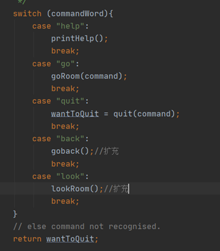 

##3.拓展功能
1.扩展游戏，使得一个房间里可以存放任意数量的物件，每个物件可以有一个描述和一个重量值，玩家进入一个房间后，可以通过“look”命令查看当前房间的信息以及房间内的所有物品信息；
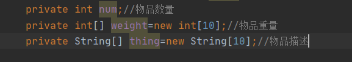 

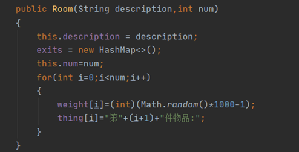 

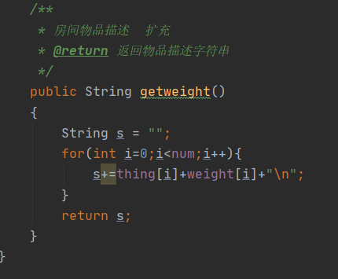

  
2.在游戏中实现一个“back”命令，玩家输入该命令后会把玩家带回上一个房间；
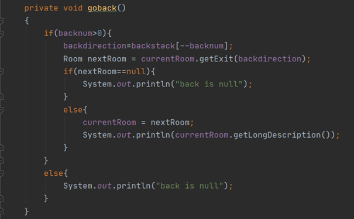  

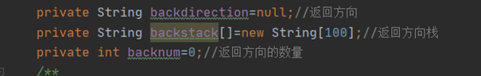 

3.在游戏中实现一个更高级的“back”命令，重复使用它就可以逐层回退几个房间，直到把玩家带回到游戏的起点；
 

4.在游戏中增加具有传输功能的房间，每当玩家进入这个房间，就会被随机地传输到另一个房间；
 

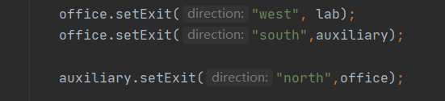

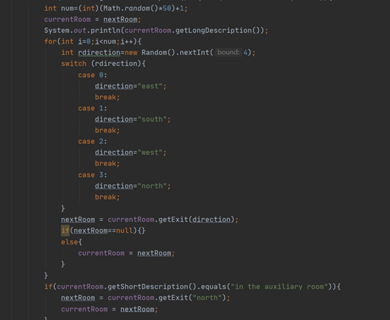

##4.单元测试
1.针对功能改进和扩充，在项目结构中编写单元测试用例，对代码执行单元测试。

2.通过idea使用junit对类中方法进行单元测试

3.对CommandWords类进行单元测试，测试方法：public void isCommand()
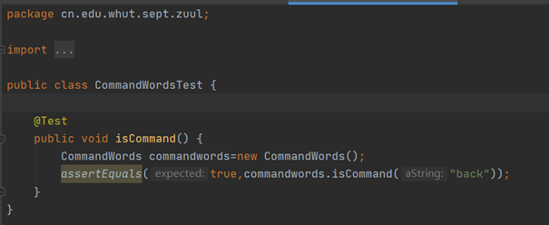

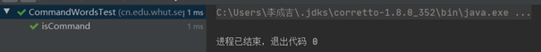
4.对Command类进行单元测试，测试方法：public void getCommandWord()，public void getSecondWord()，public void isUnknown()，public void hasSecondWord()
![Alt text]p13.png)

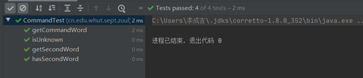
5.对Room类进行单元测试，测试方法：public void getShortDescription()，public void getLongDescription()，public void getExit()
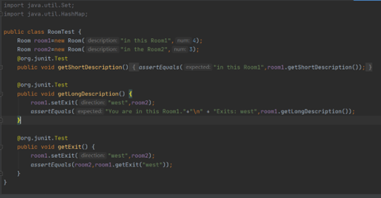

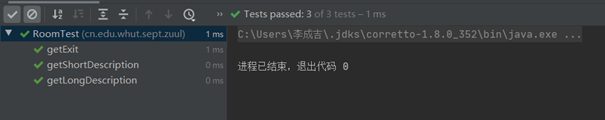

##4.实施情况
1.执行go命令：
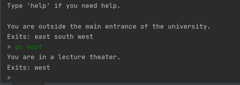

2.执行help命令：

3.执行quit命令：
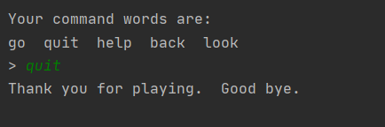

4.执行look命令
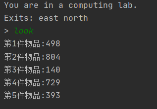

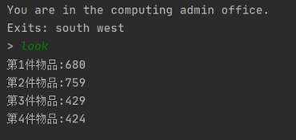

5.执行back命令：

实现高级的back命令可以逐层返回多个房间
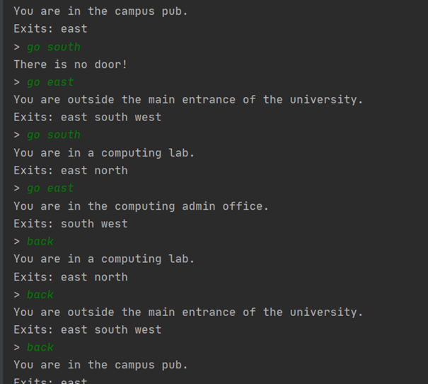

##5.uml设计
类图

用例图

